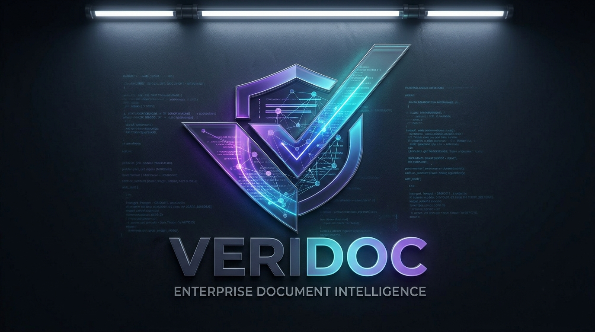

# Veridoc — Enterprise Document Intelligence System

<div align="center">



**Production-grade RAG system for enterprise contract intelligence**

[](https://veridoc-two.vercel.app)
[](https://github.com/khabteehouse-del/veridoc)
[](https://www.linkedin.com/in/beyondtahir/)

</div>

---

## Overview

Veridoc is a production-grade Enterprise Document Intelligence System built on a full RAG (Retrieval-Augmented Generation) architecture. It transforms how legal, procurement, and compliance teams interact with contracts and enterprise documents — delivering citation-grounded answers, structured data extraction, autonomous agent reviews, and multi-document comparison with zero data egress.

Built for regulated industries in the UAE and GCC market where data sovereignty is non-negotiable.

---

## Features

### Core Intelligence
- **RAG-Powered Q&A** — Ask questions in plain English. Get precise answers grounded in citations traced to the exact source section. No hallucination.
- **Executive Summaries** — Automatically generated summaries with structured key points extracted from any document.
- **Structured Extraction** — 12-field JSON schema output covering parties, effective dates, expiry dates, contract value, governing law, payment terms, notice periods, key obligations, identified risks, termination conditions, and confidentiality clauses.

### Autonomous Agent
- **Contract Review Agent** — A 4-step autonomous pipeline that independently runs extraction → risk analysis → executive summary → final review report without a single human instruction between steps.
- **Risk Assessment** — Identifies red flags, assesses risk level (Low/Medium/High), and generates actionable recommendations.

### Multi-Document Intelligence
- **Cross-Document Comparison** — Select multiple documents and ask comparative questions across all of them simultaneously. Returns structured per-document analysis with a consolidated comparison summary.

### Enterprise Architecture
- **Zero Data Egress** — All embedding generation runs locally via Ollama. No document content, query, or extracted data ever reaches a third-party server.
- **Document Library** — Persistent document management with preview, metadata, and delete functionality.
- **Navigation Persistence** — Session state preserved across browser refreshes.

---

## Tech Stack

| Layer | Technology |
|---|---|
| Frontend | Next.js 16, TypeScript, Tailwind CSS, shadcn/ui |
| Animations | Framer Motion |
| Database | Supabase (PostgreSQL + pgvector) |
| Vector Search | pgvector with IVFFlat index, cosine similarity |
| LLM Inference | Groq — Llama 3.3 70B |
| Local Embeddings | Ollama — nomic-embed-text (768 dimensions) |
| Cloud Embeddings | Google Gemini embedding-001 (production) |
| Document Parsing | pdf-parse, mammoth |
| Text Splitting | LangChain RecursiveCharacterTextSplitter |
| Deployment | Vercel (frontend + API) + Supabase (database) |

---

## Architecture Overview

```
┌─────────────────────────────────────────────────────────┐
│                     VERIDOC SYSTEM                      │
├─────────────┬───────────────────────────────────────────┤
│   INGESTION │  Upload → Parse → Chunk → Embed → Store  │
├─────────────┼───────────────────────────────────────────┤
│   RETRIEVAL │  Query → Embed → Vector Search → Rank    │
├─────────────┼───────────────────────────────────────────┤
│    ROUTING  │  Intent Classification → Pipeline Select  │
├─────────────┼───────────────────────────────────────────┤
│  GENERATION │  Context + Prompt → LLM → Grounded Answer│
├─────────────┼───────────────────────────────────────────┤
│      AGENT  │  Plan → Execute → Observe → Report        │
└─────────────┴───────────────────────────────────────────┘
```

---

## RAG Pipeline Flow

```
1. DOCUMENT INGESTION
   PDF/DOCX Upload
        ↓
   Text Extraction (pdf-parse / mammoth)
        ↓
   Semantic Chunking (1000 chars / 200 overlap)
        ↓
   Embedding Generation (nomic-embed-text / Gemini)
        ↓
   Vector Storage (Supabase pgvector)

2. QUERY PROCESSING
   User Question
        ↓
   Query Embedding
        ↓
   Intent Classification (Q&A / Summarize / Extract)
        ↓
   Cosine Similarity Search (pgvector IVFFlat)
        ↓
   Top-K Chunk Retrieval (threshold: 0.3)
        ↓
   LLM Generation with Context (Llama 3.3 70B)
        ↓
   Grounded Response with Citations

3. AGENT PIPELINE (Contract Review)
   Step 1 → Structured Extraction
   Step 2 → Risk Analysis
   Step 3 → Executive Summary
   Step 4 → Final Review Report
```

---

## Getting Started

### Prerequisites

- Node.js 18+
- Git
- Ollama (for local embeddings)
- Supabase account
- Groq API key (free tier available)
- Google AI Studio API key (free tier available)

### Installation

```bash
# Clone the repository
git clone https://github.com/khabteehouse-del/veridoc.git
cd veridoc

# Install dependencies
npm install

# Pull the embedding model
ollama pull nomic-embed-text
```

### Database Setup

Run the following SQL in your Supabase SQL Editor:

```sql
-- Enable pgvector
create extension if not exists vector;

-- Documents table
create table documents (
  id            uuid primary key default gen_random_uuid(),
  name          text not null,
  file_type     text not null,
  size          integer,
  content       text,
  metadata      jsonb default '{}',
  created_at    timestamptz default now()
);

-- Chunks table
create table chunks (
  id            uuid primary key default gen_random_uuid(),
  document_id   uuid not null references documents(id) on delete cascade,
  content       text not null,
  embedding     vector(768),
  chunk_index   integer not null,
  metadata      jsonb default '{}',
  created_at    timestamptz default now()
);

-- Vector similarity search index
create index on chunks using ivfflat (embedding vector_cosine_ops)
  with (lists = 100);

-- Similarity search function
create or replace function match_chunks(
  query_embedding   vector(768),
  match_threshold   float,
  match_count       int,
  filter_doc_id     uuid default null
)
returns table (
  id            uuid,
  document_id   uuid,
  content       text,
  chunk_index   integer,
  metadata      jsonb,
  similarity    float
)
language sql stable
as $$
  select
    chunks.id,
    chunks.document_id,
    chunks.content,
    chunks.chunk_index,
    chunks.metadata,
    1 - (chunks.embedding <=> query_embedding) as similarity
  from chunks
  where
    (filter_doc_id is null or chunks.document_id = filter_doc_id)
    and 1 - (chunks.embedding <=> query_embedding) > match_threshold
  order by chunks.embedding <=> query_embedding
  limit match_count;
$$;

-- Grant permissions
grant all on documents to anon, authenticated;
grant all on chunks to anon, authenticated;
alter table documents disable row level security;
alter table chunks disable row level security;
```

### Environment Variables

Create a `.env.local` file in the root directory:

```env
# Groq LLM
GROQ_API_KEY=gsk_your_groq_key_here

# Supabase
NEXT_PUBLIC_SUPABASE_URL=https://your-project.supabase.co
NEXT_PUBLIC_SUPABASE_ANON_KEY=your_supabase_anon_key

# Ollama (local development)
OLLAMA_BASE_URL=http://localhost:11434

# Google Gemini (production cloud embeddings)
GOOGLE_API_KEY=your_google_ai_studio_key

# App
NEXT_PUBLIC_APP_NAME=Veridoc
```

### Run Locally

```bash
# Start Ollama (keep running in background)
ollama serve

# Start development server
npm run dev
```

Open [http://localhost:3000](http://localhost:3000)

---

## Deployment

### Vercel Deployment

1. Push to GitHub
2. Import repository in Vercel
3. Add all environment variables in Vercel dashboard
4. Deploy

**Note:** Ollama cannot run on Vercel serverless. Set `GOOGLE_API_KEY` for cloud embedding generation on production.

---

## API Routes

| Endpoint | Method | Description |
|---|---|---|
| `/api/documents` | POST | Upload and ingest a document |
| `/api/documents/list` | GET | Fetch all ingested documents |
| `/api/documents/content` | GET | Fetch document raw content |
| `/api/documents/chunks-count` | GET | Get chunk count for a document |
| `/api/documents/delete` | DELETE | Delete a document and its chunks |
| `/api/query` | POST | RAG Q&A query |
| `/api/query/multi` | POST | Multi-document comparison query |
| `/api/summarize` | POST | Generate executive summary |
| `/api/extract` | POST | Structured data extraction |
| `/api/agent/review` | POST | Autonomous contract review agent |

---

## Project Structure

```
veridoc/
├── src/
│   ├── app/
│   │   ├── api/                    # API routes
│   │   │   ├── agent/review/       # Contract Review Agent
│   │   │   ├── documents/          # Document management
│   │   │   ├── query/              # Q&A + Multi-doc comparison
│   │   │   ├── summarize/          # Summarization pipeline
│   │   │   └── extract/            # Structured extraction
│   │   ├── page.tsx                # Main app entry
│   │   ├── layout.tsx              # Root layout
│   │   └── globals.css             # Global styles
│   ├── components/
│   │   ├── layout/                 # Header, Landing, Library
│   │   ├── output/                 # Agent, Summary, Extraction, Preview
│   │   ├── query/                  # Q&A Interface
│   │   └── upload/                 # Upload Zone
│   ├── lib/
│   │   ├── supabase.ts             # Database client
│   │   ├── ollama.ts               # Embedding generation
│   │   ├── groq.ts                 # LLM client
│   │   └── parsers/                # PDF + DOCX parsers
│   ├── services/
│   │   ├── rag.ts                  # RAG pipeline
│   │   ├── retriever.ts            # Vector search
│   │   ├── chunker.ts              # Text splitting
│   │   └── intent.ts               # Intent classification
│   └── types/
│       └── index.ts                # TypeScript definitions
└── public/
    ├── hero.png                    # Landing page hero image
    └── logo-icon.png               # Veridoc logo
```

---

## Roadmap

- [ ] Supabase Auth — multi-tenant user isolation
- [ ] PDF export for agent review reports
- [ ] Arabic language document support
- [ ] Spline 3D hero section (Layer 2 UI)
- [ ] UptimeRobot integration — eliminate cold starts
- [ ] Role-based access control (RBAC)

---

## Built By

**Faraz** — AI Solutions Engineer | Enterprise AI Architect

22 years of enterprise experience spanning database administration, project management, international stakeholder engagement, and media — now building production AI systems.

[](https://www.linkedin.com/in/beyondtahir/)
[](https://github.com/khabteehouse-del)

---

<div align="center">

**Veridoc — Enterprise Document Intelligence**

*Built for legal teams, procurement departments, and compliance officers in regulated industries across the UAE and GCC.*

</div>
